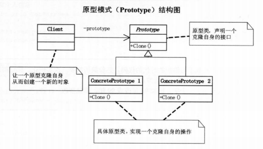
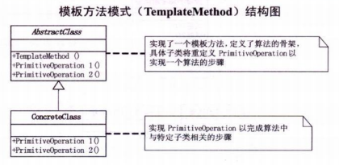
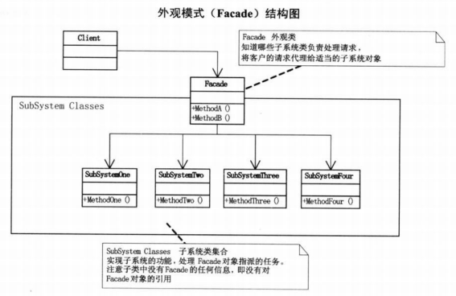
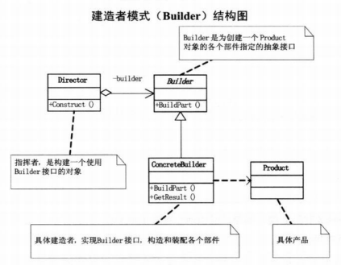
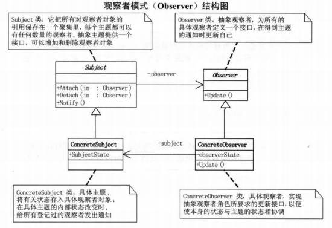
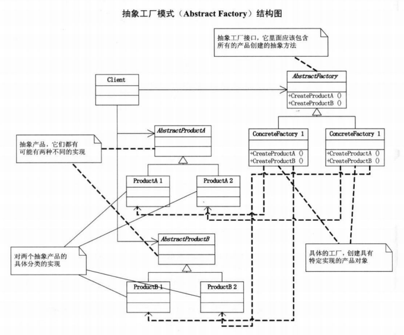
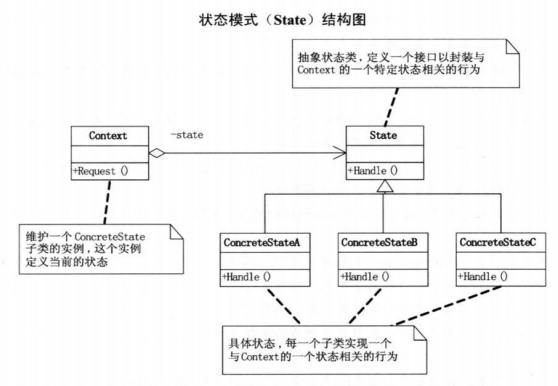
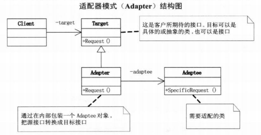

# 设计模式

## 策略模式

### 1. 定义

> 定义了算法家族，分别封装起来，让它们之间可以相互替换，此模式让算法的变化，不会影响到使用算法的客户。

### 2. 结构图


### 3. 使用的场合 

- 在分析过程中听到需要在不同的时间应用不同的业务规则，就可以考虑使用策略模式处理这种变化的可能性

### 4. 优缺点

- 优点
  - 策略模式是一种定义一系列算法的方法，这些方法完成相同的工作，只是实现不同， 它可以以相同的方法调用所有的算法，减少了算法类和使用算法类之间的耦合
  - 策略模式的Strategy类层次为Context定义了一系列可供重用的算法或行为。继承有助于析取出这些算法中的公共功能
  - 简化了单元测试，因为每个算法都有自己的类，可以通过自己的结构单独测试

## 装饰模式

### 1. 定义

> 动态地给对象添加一些额外的职责，就增加功能来说，装饰模式比生成子类更为灵活。

### 2. 结构图


### 3. 使用的场合

- 当系统需要增加新功能时，这些功能只是为了满足在某种特定的情况下才会执行的特殊行为的需要，这时可以考虑使用装饰模式，把每个要装饰的功能放在单独的类中，并让这个类包装它所要装饰的对象，当需要执行特殊行为时，客户代码就可以在运行时根据需要有选择地、按顺序地使用装饰功能包装对象，而不需要去更改原有的核心的类。

### 4. 优缺点

- 优点
  - 把类中的装饰功能从类中搬移去除，这样可以简化原有的类
  - 有效地把类的核心职责和装饰功能区分开，而且可以去除相关类中重复的装饰逻辑

## 代理模式

### 1. 定义

> 为其他对象提供一种代理以控制对这个对象的访问

### 2. 结构图


### 3. 使用的场合

- 远程代理，也就是为一个对象在不同的地址空间提供局部代表，这样可以隐藏一个对象存在于不同地址空间的事实
- 虚拟代理，是根据需要创建开销很大的对象，通过它来存放实例化需要很长时间的真实对象
- 安全代理，用来控制真实对象访问时的权限
- 智能指引，是指当调用真实的对象时，代理处理另外一些事。

## 工厂方法模式

### 1. 定义

> 定义一个用于创建对象的接口，让子类决定实例化哪一个类，工厂方法使一个类的实例化延迟到其子类

### 2. 结构图


### 3. 优缺点

- 优点
  - 工厂方法克服了简单工厂方法违背开放-封闭原则的缺点（增加新的类时需要在工厂中增加判断分支），又保持了封装对象创建过程的优点
- 缺点
  - 每增加一个产品，就需要加一个产品工厂的类，增加了额外的开发量

## 原型模式

### 1. 定义

> 用原型实例指定创建对象的种类，并且通过拷贝这些原型创建新的对象。

### 2. 结构图



### 3. 浅复制与深复制

- 浅复制，被复制对象的所有变量都含有与原来的对象相同的值，而所有的对其他对象的引用都仍然指向原来的对象
- 深复制，把引用对象的变量指向复制过的新对象，而不是原有的被引用的对象。

### 4. 优缺点

- 优点
  - 一般在初始化信息不发生变化的情况下，克隆是最好的办法，既隐藏了对象创建的细节，有提高了性能
  - 不用重新初始化对象，而是动态地获得对象运行时的状态。

## 模板方法模式

### 1. 定义

> 定义一个操作中的算法的骨架，而将一些步骤延迟到子类中，模板方法使得子类可以不改变一个算法的结构即可重定义该算法的某些特定的步骤。

### 2. 结构图



### 3. 使用的场合

- 当遇到由一系列步骤构成的过程需要执行，这个过程从高层次上看是相同的，但步骤的实现可能不同，这时可以考虑使用模板方法模式

### 4. 优点

- 当不变的和可变的行为在方法的子类实现中混合到一起时，不变的行为就会在子类中重复，通过模板方法把这些行为搬移到单一的地方，这样就可以帮助子类摆脱重复的不变行为的纠缠。

## 外观模式

### 1. 定义

> 为子系统中的一组接口提供一个一致的界面，此模式定义了一个高层接口，这个接口使得这一子系统更加容易使用。

### 2. 结构图



### 3. 使用的场合

- 在设计初期阶段，应该有意识的将不同的两个层分离，在层与层之间建立外观Facade。
- 在开发阶段，子系统往往因为不断的重构演化而越来越复杂，增加外观Facade可以提供一个简单的接口，减少类之间的依赖
- 在维护一个大型的遗留系统时，可以为新系统开发外观Facade类，来提供设计粗糙或高度复杂的遗留代码的比较清晰简单的接口，让新系统与Facade对象交互，Facade与遗留代码交互所有复杂的工作。

## 建造者模式

### 1. 定义

> 将一个复杂对象的构建与它的表示分离，使得同样的构建过程可以创建不同的表示。

### 2. 结构图



###3. 使用的场合

-  建造者模式是在当创建复杂对象的算法应该独立于该对象的组成部分以及它们的装配方式时适用的模式

### 4. 优缺点

- 优点
  - 使得建造代码与表示代码分离，由于建造者隐藏了该产品是如何组装的，所以若需要改变一个产品的内部表示，只需要再定义一个具体的建造者就可以了。

## 观察者模式

### 1. 定义

> 定义了一种一对多的依赖关系，让多个观察者对象同时监听某一个主题对象，这个主题对象在状态发生变化时，会通知所有观察者对象，使他们能够自动更新自己。

### 2. 结构图



### 3. 使用的场合

- 当一个对象的改变需要同时改变其他对象的时候，而且它不知道有多少对象有待改变，应该考虑使用观察者模式
- 当一个抽象模型有两个方面，其中一方面依赖另一方面，这时用观察者模式可以将这两者封装在独立的对象中使他们各自独立地改变和复用。

### 4. 优缺点

- 优点
  - 解除类之间的耦合，让耦合的双方都依赖于抽象，而不是依赖于具体，从而使得各自的变化不会影响另一边的变化。
- 缺点
  - 抽象通知者还是依赖抽象观察者
  - 每个具体的观察者在通知者状态更新时调用的方法不一定一致。

## 抽象工厂模式

### 1. 定义

> 提供一个创建一系列相关或相互依赖对象的接口，而无需制定它们具体的类

### 2. 结构图



### 3. 优缺点

- 优点
  - 易于交换产品系列，具体的工厂类在一个应用中只需要在初始化的时候出现一次，这就使得改变一个应用的具体工厂非常容易。
  - 具体的创建实例过程与客户端分离，客户端通过抽象接口操纵实例，产品的具体类名也被具体工厂的实现分离，不会出现在客户代码中。
- 缺点
  - 更改代码时需要大批量的改动

##  状态模式

### 1. 定义

> 当一个对象的内在状态改变时允许改变其行为，这个对象看起来像是改变了其类。

### 2. 结构图



### 3. 使用的场合

- 当控制一个对象状态装换的条件表达式过于复杂时，把状态的判断逻辑转移到表示不同状态的一系列类当中
- 当一个对象的行为取决于他的状态时，并且它必须在运行时刻根据状态改变它的行为时，可以考虑使用状态模式

### 4. 优缺点

- 优点
  - 将与特定状态相关的行为局部化，并且将不同状态的行为分割开来
  - 将特定的状态相关的行为都放入一个对象中，由于所有与状态相关的代码都存在于一个类中，所以通过定义新的子类可以很容易地增加新的状态和转换。
  - 状态模式通过把各种状态转移逻辑分布到state的子类之间，减少了相互间的依赖。

## 适配器模式

### 1. 定义

> 将一个类的接口转换成客户希望的另外一个接口，Adapter模式使得原本由于接口不兼容而不能一起工作的那些类可以一起工作。

### 2. 结构图



### 3. 使用的场合

- 主要应用于希望复用一些现存的类，但是接口又与复用环境不一致的情况。

##  组合模式

### 1. 定义

> 将对象组合成树形结构以表示‘部分-整体’的层次结构。组合模式使得用户对单个对象和组合对象的使用具有一致性

### 2. 结构图


### 3. 使用的场合

- 需求中体现了部分与整体的层次结构
- 希望用户可以忽略组合对象和单个对象的不同，统一地使用组合结构中的所有对象

### 4. 优点

- 组合模式可以让用户一致地使用组合结构和单个对象

## 迭代器模式

### 1. 定义

> 提供一种方法顺序访问一个聚合对象的各个元素，而又不暴露该对象的内部表示

### 2. 结构图


### 3. 使用的场合

- 一个聚集对象，不管对象是什么都需要遍历时，应该考虑使用迭代器模式
- 需要对聚集对象有多种方式遍历时

### 4. 优点

- 分离了集合对象的遍历行为，抽象出一个迭代器类来负责，这样既可以不暴露集合的内部结构，又让外部代码透明地访问集合内部数据。

## 单例模式

### 1. 定义

> 保证一个类仅有一个实例，并提供一个访问它的全局访问点
>
> 通常我们可以声明一个全局变量使得一个对象被访问，但不能阻止你实例化多个对象，最好的方法是，让类本身负责保存它的唯一实例，这个类可以保证没有其他实例可以被创建，而且他可以提供一个访问该实例的方法。

### 2. 结构图


### 3. 优点

- 保证类只有唯一的实例
- 因为只有一个实例，所以可以控制用户怎样访问以及何时访问它

### 4. 多线程时的单例

- 使用锁来处理

  ```java
  class Singleton{
    public  static Singleton singleton;
    private static final Object object=new Object();
    private Singleton(){}
    public static Singleton getInstance(){
        if(singleton==null){
            synchronized(object){
                if(singleton==null){
                    singleton=new Singleton();
                }
            }
        }
      return singleton;
    } 
  }
  ```

### 5. 懒汉式加载和饿汉式加载

- 懒汉式单例：在第一次被引用时才会实例化，会有多线程访问的安全问题

  ```java
  class Singleton{
    public static Singleton singleton;
    private Singleton(){}
    public static Singleton getInstance(){
        if(singleton==null){
            singleton=new Singleton();
        }
      return singleton;
    }
  }
  ```

- 饿汉式单例：在类被加载时就将自己实例化,会提前占用系统资源

  ```java
  class Singleton{
    public static final Singleton singleton=new Singleton();
    private Singleton(){}
    public static Singleton getInstance(){
        return singleton;
    }
  }
  ```

## 桥接模式

### 1. 定义

>将抽象部分与它的实现部分分离，使它们都可以独立地变化。
>
>实现系统可能有多角度分类，每一种分类都有可能变化，那么就把多角度分离出来让它们独立变化，减少它们之间的耦合

### 2. 结构图


### 3. 使用的场合

- 当需要从多角度去分类实现对象，而继承会造成大量的类增加，不能满足开放-封闭原则时，考虑使用桥接模式

### 4. 优点

- 减少类之间的耦合

## 命令模式

### 1. 定义

> 将一个请求封装为一个对象，从而使你可用不同的请求对客户进行参数化：对请求排队或记录请求日志，以及支持可撤销的操作。

### 2. 结构图


### 3. 使用场合

- 需要记录请求日志，以及要支持撤销和重做时，可考虑使用命令模式

### 4. 优点

- 比较容易地设计一个命令队列
- 容易将命令记入日志
- 允许接收请求的一方决定是否接受请求
- 容易实现对请求的撤销和重做
- 加入新的具体命令类不影响其他的类，因此增加新的命令很容易
- 把请求一个操作的对象与知道怎么执行该操作的对象分离开

## 职责链模式 

### 1. 定义

> 使多个对象都有机会处理请求，从而避免请求的发送者和接收者的耦合关系。将这个对象连成一条链，并沿着这条链传递该请求，直到有一个对象处理它为止。

### 2. 结构图


### 3. 使用的场合

- 当有多个处理请求的对象，而且开始并不确定处理请求的是哪个对象，可以使用职责链模式，将对象连成一条链，让请求沿着该链进行传递

### 4. 优点

- 接收者和发送者都没有对方的明确信息，且链中的对象自己也不知道链的结构，简化对象的相互链接，它们仅需保持一个指向后继者的引用，而不需保持它所有这的候选引用，降低耦合度。
- 可以随时增加或修改处理一个请求的结构，增强了给对象指派职责的灵活性。

## 中介者模式

### 1. 定义

> 用一个中介对象来封装一系列的对象交互。中介者使各个对象不需要显式地相互引用，从而使其耦合松散，而且可以独立地改变他们之间的交互

### 2. 结构图


### 3. 使用的场合

- 当系统中有多个对象，并且各个对象又相互关联时，可以考虑使用中介者模式来封装对象的交互
- 一组对象以定义良好但是复杂的方式进行通信的场合
- 想定制一个分布在多个类中的行为，而又不想生成太多的子类

### 4. 优缺点

- 优点
  - 减少各个对象之间的耦合，可以对立改变和复用各个对象
  - 对对象之间的交互作了抽象， 将中介作为一个独立的概念并将其封装在一个对象中，这样关注的对象就从对象各自本身的行为转移到他们之间的交互上来，站在一个更宏观的角度看待系统。
- 缺点
  - 中介者控制了集中化，把交互的复杂性变为中介者的复杂性，中介者会比较复杂

## 享元模式

### 1. 定义

> 运用共享技术有效地支持大量细粒度的对象

### 2. 结构图


### 3. 使用的场合

- 如果一个应用程序使用了大量的对象，这些对象造成了大量的存储开销时就应该考虑使用享元模式
- 对象的大多数状态可以是外部状态，如果删除对象的外部状态，可以使用相对较少的共享对象来取代很多组对象，此时可以考虑使用享元模式。

### 4. 优缺点

- 优点
  - 运用享元模式可以有效地支持大量细粒度的对象，节约了大量对象的存储空间
- 缺点
  - 需要维护一个记录了系统所有享元的列表，这需要消耗资源
  - 享元模式使系统更加复杂

## 解释器模式

### 1. 定义

> 给定一个语言，定义他的文法的一种表示，并定义一种解释器，这个解释器使用该表示来解释语言中的句子。

### 2. 结构图


### 3. 使用的场合

- 如果一种特定类型的问题发生的频率足够高，那么就可能值得将该问题的各个实例表述为一个简单语言中的句子，这样就可以构建一个解释器，该解释器通过解释这些句子来解决问题
- 当有一个语言需要解释执行，并且你可以将该语言中的句子抽象为语法树时，就可以使用解释器模式

### 4. 优缺点

- 优点
  - 容易改变和扩展文法。因为该模式使用类来表示文法规则，你可以使用继承来改变或扩展该文法。
  - 比较容易实现文法，因为定义抽象语法树中各个节点的类的实现大体类似，这些类都易于编写
- 缺点
  - 解释器模式为每一条文法规则都定义了一个类，包含许多规则的文法比较难以维护和管理

## 访问者模式

### 1. 定义

> 表示一个作用于某对象结构中的各元素的操作，它使你可以在不改变各元素的类的情况下定义作用于这些元素的新操作

### 2. 结构图


### 3. 使用的场合

- 访问者模式适用于数据结构相对稳定的系统，它把数据结构和作用于结构上的操作之间的耦合解脱开，使得操作可以自由地演化

### 4. 优缺点

- 优点
  - 访问者模式增加新的操作很容易，因为增加新的操作就意味着增加一个新的访问者。访问者模式将有关的的行为集中到一个访问者对象中。
- 缺点
  - 增加新的数据结构比较困难

# 面向对象设计原则

## 单一职责原则

> 就一个类而言，应该仅有一个引起它变化的原因。

## 开放封闭原则

> 软件实体（类、模块、函数等）应该可以扩展，但是不可以修改。即对扩展开放，对更改封闭。

## 里氏代换原则

> 子类型必须能够替换掉它们的父类型

## 依赖倒置原则

> - 高层模块不应该依赖底层模块，两个都应该依赖抽象
> - 抽象不应该依赖细节，细节应该依赖抽象（针对接口编程，不要针对实现编程）

## 迪米特法则（最少知识原则）

> 如果两个类不必彼此直接通信，那么这两个类就不应当发生直接的相互作用。如果一个类要调用其中另一个类的某一个方法，可以通过第三者转发这个调用。


## 组合/聚合复用原则

> 尽量使用组合/聚合，尽量不要使用类继承

- 聚合：表示一种弱的“拥有“关系，体现的是A对象可以包含B对象，但B对象不是A对象的一部分；
- 组合：表示一种强的”拥有“关系，体现了严格的部分和整体的关系，部分和整体的生命周期一致。